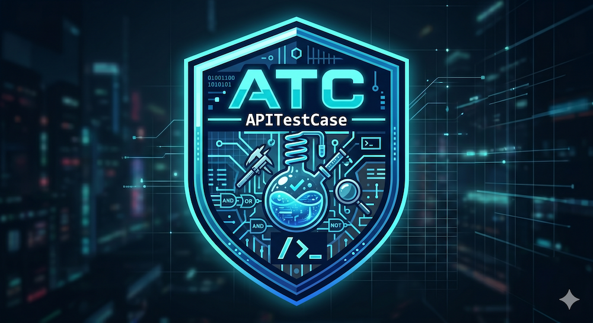

<p align="center">
  
</p>

<h1 align="center">ATC - APITestCase</h1>

<p align="center">
  A fluent, batteries-included testing layer for Symfony JSON APIs.
</p>

<p align="center">
  <a href="https://packagist.org/packages/tyloo/atc"></a>
  <a href="https://packagist.org/packages/tyloo/atc"></a>
  <a href="https://github.com/tyloo/atc/actions/workflows/ci.yaml"></a>
  <a href="https://codecov.io/gh/tyloo/atc"></a>
  <a href="LICENSE"></a>
  
  
</p>

---

**Fluent API testing for Symfony, with zero boilerplate.** ATC is a batteries-included testing layer on top of `WebTestCase`: chained HTTP+JSON assertions, JSON Schema and JMESPath, container-aware mocking, profiler-backed N+1 detection, and ready-to-use in-memory swaps for Messenger, Mailer, Notifier, HTTP client, and Cache.

## Contents

- [Installation](#installation)
- [Quick start](#quick-start)
- [Issuing requests](#issuing-requests)
- [Asserting on responses](#asserting-on-responses)
- [JMESPath assertions](#jmespath-assertions)
- [JSON Schema validation](#json-schema-validation)
- [Performance assertions](#performance-assertions)
- [Authentication](#authentication)
- [Container mocking](#container-mocking)
- [Database](#database)
- [Messenger](#messenger)
- [Mailer](#mailer)
- [Notifier](#notifier)
- [HTTP client](#http-client)
- [Cache](#cache)
- [Profiler & N+1 detection](#profiler--n1-detection)
- [Customization](#customization)
- [Compatibility](#compatibility)
- [Recommended companions](#recommended-companions)

## Installation

```bash
composer require --dev tyloo/atc
```

That is it. No bundle to register, no YAML to write. Extend `Tyloo\Atc\ApiTestCase` in any functional test and you have the full surface. Sensible defaults out of the box:

- `tests/Schemas/` for JSON Schema files
- No default headers, no default mocks
- In-memory transports auto-discovered from your `framework.messenger` config
- HTTP client mock is strict (unmatched outbound requests fail the test)

Each default has a protected override hook on the test case (see [Customization](#customization)).

## Quick start

A realistic scenario:

- Spin up an authenticated admin with [Zenstruck Foundry](https://github.com/zenstruck/foundry)
- Validate the response against a JSON Schema
- Assert the welcome email got queued
- Confirm the row landed in the database

```php
final class CreateUserTest extends ApiTestCase
{
    use Factories;
    use ResetDatabase;
    use InteractsWithDatabase;
    use InteractsWithMessenger;

    #[Test]
    public function admin_creates_a_user_and_queues_welcome_email(): void
    {
        $admin = AdminFactory::createOne();

        $this->actingAs($admin)
            ->post('/api/users', json: [
                'email' => 'jean@bond.com',
                'name'  => 'Jean Bond',
            ])
            ->assertStatus(201)
            ->assertMatchesJsonSchema('users/create.json')
            ->assertJsonPath('data.email', 'jean@bond.com')
            ->assertHeader('Location', '/api/users/42');

        $this->assertDatabaseHas(User::class, ['email' => 'jean@bond.com']);
        $this->assertMessageDispatched(
            SendWelcomeEmail::class,
            fn (SendWelcomeEmail $m) => $m->email === 'jean@bond.com',
        );
    }
}
```

One method, no setup boilerplate. The rest of this README walks through every feature in detail.

## Issuing requests

All HTTP verbs are available on the test case via `InteractsWithApi` (auto-loaded in `ApiTestCase`):

```php
$this->get('/api/users');
$this->post('/api/users', json: ['name' => 'Alice']);
$this->patch('/api/users/1', json: ['name' => 'Bob']);
$this->put('/api/users/1', json: [...]);
$this->delete('/api/users/1');
```

Headers and query strings are first-class arguments:

```php
$this->get('/api/users',
    headers: ['X-Tenant' => 'acme'],
    query:   ['filter' => 'active', 'page' => 2],
);
```

Form payloads and file uploads:

```php
$this->post('/api/login', formData: ['username' => 'a', 'password' => 'b']);
$this->post('/api/uploads', files: ['file' => $uploadedFile]);
```

When `json:` is provided it takes precedence; `formData` is ignored. `Content-Type: application/json` is set automatically.

Persist headers across multiple requests in the same test:

```php
$this->withHeaders(['Accept-Language' => 'fr'])
    ->get('/api/users')
    ->assertJsonContains(['greeting' => 'Bonjour']);

$this->get('/api/products')->assertStatusOk(); // still sends Accept-Language: fr
```

## Asserting on responses

Every verb call returns an `ApiResponse` that you can chain assertions on:

```php
$this->get('/api/users/42')
    ->assertStatusOk()                          // 200
    ->assertHeader('Content-Type', 'application/json')
    ->assertJsonContains(['id' => 42, 'name' => 'Alice'])
    ->assertJsonPath('roles[0]', 'admin');
```

### Status

```php
$response->assertStatus(200); // exact match
$response->assertStatusOk();  // shorthand for the common case
```

### Headers

```php
$response->assertHeader('Content-Type', 'application/json');
$response->assertHeaderHas('ETag');         // present, value irrelevant
$response->assertHeaderMissing('X-Debug-Token');
```

### JSON body, exact match

```php
$response->assertJson([
    'id'   => 1,
    'name' => 'Alice',
]);
```

Order and types must match. Use `assertJsonContains` when you only care about a subset.

### JSON body, subset match

```php
$response->assertJsonContains([
    'data' => ['email' => 'alice@example.com'],
]);
```

Recursive: nested arrays only need to contain the listed keys.

### Raw access

When the assertion helpers aren't enough, grab the decoded body directly:

```php
$body = $response->json();                  // decoded array
$email = $response->json('data.email');     // JMESPath expression

$status = $response->statusCode();          // int
$body   = $response->content();             // raw string
$ms     = $response->responseTimeMs();      // float
$raw    = $response->raw();                 // Symfony Response

$response = $this->lastResponse();          // last response from this test
```

## JMESPath assertions

ATC uses [JMESPath](https://jmespath.org) for navigating JSON responses (powered by `mtdowling/jmespath.php`):

```php
$response
    ->assertJsonPath('user.email', 'alice@example.com')
    ->assertJsonPath('data[0].active', true)
    ->assertJsonPath('roles | length(@)', 3);
```

Pass a callable to assert with a predicate (truthy = pass):

```php
$response->assertJsonPath('id', fn ($v) => is_int($v) && $v > 0);
```

Assert that a path **does not** resolve to a value, or count items at a path:

```php
$response->assertJsonMissingPath('deleted_at');
$response->assertJsonCount(3, 'data');
$response->assertJsonCount(2);              // root must be an array of 2
```

## JSON Schema validation

Drop a JSON Schema file under `tests/Schemas/` (configurable; see [Customization](#customization)) and validate the response shape against it:

```json
// tests/Schemas/users/create.json
{
    "$schema": "https://json-schema.org/draft/2020-12/schema",
    "type": "object",
    "required": ["data"],
    "properties": {
        "data": {
            "type": "object",
            "required": ["id", "email", "name"],
            "properties": {
                "id":    { "type": "integer" },
                "email": { "type": "string", "format": "email" },
                "name":  { "type": "string" }
            }
        }
    }
}
```

```php
$this->post('/api/users', json: [...])
    ->assertStatus(201)
    ->assertMatchesJsonSchema('users/create.json');
```

Powered by `justinrainbow/json-schema`. Failures include the schema path and a human-readable list of validation errors.

## Performance assertions

Wall-clock duration of each request is measured automatically:

```php
$this->get('/api/heavy-report')
    ->assertStatusOk()
    ->assertResponseTimeLessThan(500)       // < 500 ms
    ->assertResponseTimeBetween(50, 500);   // sanity bounds (catch suspiciously-fast cached responses)
```

Tip: use generous bounds in CI to avoid flakiness.

## Authentication

ATC targets stateless / token-based APIs, so authentication is just "attach the right header to the next request".

### Raw tokens

```php
$this->withToken('eyJhbGciOi...')->get('/api/me')->assertStatusOk();

// custom scheme
$this->withToken('xxx', scheme: 'Basic')->get('/api/me');
```

### `actingAs($user)` — paired with Foundry

By default, `actingAs($user)` looks for a `getApiToken(): string` method on the user object and attaches the result as a Bearer token. Perfect when your `User` entity already exposes an API token.

The recommended pattern: build the user with [Zenstruck Foundry](https://github.com/zenstruck/foundry), then pass it straight to `actingAs()`:

```php
use App\Factory\UserFactory;
use Tyloo\Atc\ApiTestCase;
use Zenstruck\Foundry\Test\Factories;
use Zenstruck\Foundry\Test\ResetDatabase;

final class ProfileTest extends ApiTestCase
{
    use Factories;
    use ResetDatabase;

    #[Test]
    public function returns_authenticated_users_profile(): void
    {
        $alice = UserFactory::createOne(['email' => 'alice@example.com']);

        $this->actingAs($alice)
            ->get('/api/me')
            ->assertStatusOk()
            ->assertJsonPath('email', 'alice@example.com');
    }
}
```

Your `User` entity (or its Foundry factory) just needs a `getApiToken(): string` accessor. Foundry handles persistence, `actingAs()` handles the Bearer header, ATC handles the rest.

### Custom auth strategy

Override `authenticate()` in your base test case to plug in any strategy (JWT, HMAC signature, opaque token, anything that maps `user → request credentials`):

```php
use Tyloo\Atc\ApiTestCase;
use Tyloo\Atc\Http\ApiClient;

abstract class BaseApiTestCase extends ApiTestCase
{
    #[\Override]
    protected function authenticate(object $user, ApiClient $client): ApiClient
    {
        $jwt = static::getContainer()->get(JWTTokenManagerInterface::class);

        return $client->withToken($jwt->create($user));
    }
}
```

`actingAs($user)` will then route through your override across every test that extends `BaseApiTestCase`. No registry, no `$using:` argument, no bundle config — one method, one strategy per test suite.

## Container mocking

`InteractsWithContainer` lets you swap services for test doubles without touching `services.yaml`.

### Full mock

```php
$shopify = $this->mockService(ShopifyService::class);
$shopify->expects(self::once())
    ->method('createCustomer')
    ->willReturn('cust_123');

$this->post('/api/customers', json: ['email' => 'a@b.c'])->assertStatus(201);
```

### Partial mock (real behavior on un-listed methods)

```php
$notifier = $this->partialMockService(NotifierService::class, ['send']);
$notifier->method('send')->willReturn(null);
// every other method on NotifierService keeps its real implementation.
```

Partial mocks require a concrete class.

### Inject any object as a service

```php
$this->setService('app.feature_flags', new InMemoryFeatureFlags(['beta' => true]));
```

### Default mocks for the whole test suite

Centralize "always-mocked-in-tests" services in a base test case:

```php
abstract class BaseApiTestCase extends ApiTestCase
{
    protected function defaultMocks(): array
    {
        return [
            ShopifyService::class => fn () => $this->createMock(ShopifyService::class),
        ];
    }
}
```

## Database

Add the trait. ATC does not manage database lifecycle, so pair it with [Zenstruck Foundry](https://github.com/zenstruck/foundry) or `DAMA/DoctrineTestBundle`:

```php
final class CreateUserTest extends ApiTestCase
{
    use Factories;
    use ResetDatabase;
    use InteractsWithDatabase;

    #[Test]
    public function admin_creates_user_persists_row(): void
    {
        $admin = UserFactory::createOne(['role' => 'admin']);

        $this->actingAs($admin)
            ->post('/api/users', json: ['email' => 'new@example.com'])
            ->assertStatus(201);

        $this->assertDatabaseHas(User::class, ['email' => 'new@example.com']);
        $this->assertDatabaseMissing(User::class, ['email' => 'deleted@example.com']);
        $this->assertDatabaseCount(User::class, 2);
    }
}
```

## Messenger

`InteractsWithMessenger` discovers `in-memory://` transports and lets you inspect dispatched messages. Handlers do **not** auto-execute, so you assert on the dispatch itself:

```php
use Tyloo\Atc\Trait\InteractsWithMessenger;

final class BulkImportTest extends ApiTestCase
{
    use InteractsWithMessenger;

    #[\PHPUnit\Framework\Attributes\Test]
    public function csv_upload_queues_one_message_per_row(): void
    {
        $this->post('/api/imports', files: ['csv' => $this->uploadCsv('100-rows.csv')])
            ->assertStatus(202);

        $this->assertMessagesDispatchedCount(100, ImportRow::class);
        $this->assertMessageDispatched(
            ImportRow::class,
            fn (ImportRow $row) => $row->email === 'first@example.com',
        );
    }
}
```

Other helpers:

```php
$this->assertNoMessagesDispatched();                    // any class
$this->assertNoMessagesDispatched(SendEmail::class);    // class-specific

$all     = $this->dispatchedMessages();                 // list<object>
$welcomes = $this->dispatchedMessages(SendWelcomeEmail::class);
```

## Mailer

`InteractsWithMailer` swaps the real Mailer for an in-memory capture and exposes assertions on sent emails:

```php
use Tyloo\Atc\Trait\InteractsWithMailer;

final class PasswordResetTest extends ApiTestCase
{
    use InteractsWithMailer;

    #[\PHPUnit\Framework\Attributes\Test]
    public function reset_request_sends_a_one_time_link(): void
    {
        $this->post('/api/password/reset', json: ['email' => 'alice@example.com'])
            ->assertStatusOk();

        $this->assertEmailSent();
        $this->assertEmailSentTo(
            'alice@example.com',
            fn (Email $email) => str_contains((string) $email->getSubject(), 'Reset your password'),
        );
        $this->assertNoEmailsSent(); // for negative paths
    }
}
```

## Notifier

`InteractsWithNotifier` captures Symfony Notifier sends:

```php
use Tyloo\Atc\Trait\InteractsWithNotifier;

final class OutageAlertTest extends ApiTestCase
{
    use InteractsWithNotifier;

    #[\PHPUnit\Framework\Attributes\Test]
    public function downstream_error_pages_the_oncall(): void
    {
        $this->mockService(StatusPageClient::class)
            ->method('latest')
            ->willThrowException(new \RuntimeException('upstream down'));

        $this->get('/api/health')->assertStatus(503);

        $this->assertNotificationSent();
        $this->assertSame(1, $this->sentNotifications()->count());
    }
}
```

## HTTP client

`InteractsWithHttpClient` swaps the Symfony HTTP client for a `MockHttpClient` you control, and records every outbound request:

```php
use Symfony\Component\HttpClient\Response\MockResponse;
use Tyloo\Atc\Trait\InteractsWithHttpClient;

final class GeocodingTest extends ApiTestCase
{
    use InteractsWithHttpClient;

    #[\PHPUnit\Framework\Attributes\Test]
    public function address_lookup_calls_geocoder_with_signed_query(): void
    {
        $this->mockHttpClient([
            new MockResponse(json_encode(['lat' => 48.85, 'lng' => 2.35]), ['http_code' => 200]),
        ]);

        $this->post('/api/addresses', json: ['street' => '1 rue de Rivoli'])
            ->assertStatus(201)
            ->assertJsonPath('lat', 48.85);

        $this->assertHttpRequestSent('GET', 'https://api.example.com/geocode');
    }
}
```

By default the mock is strict: an unmatched request fails the test. Override `resolveHttpClientStrict()` in your test case to return `false` if you'd rather let unmatched requests pass through.

## Cache

`InteractsWithCache` swaps every cache pool for an `ArrayAdapter`:

```php
use Tyloo\Atc\Trait\InteractsWithCache;

final class RateLimitTest extends ApiTestCase
{
    use InteractsWithCache;

    #[\PHPUnit\Framework\Attributes\Test]
    public function fourth_request_in_a_minute_is_throttled(): void
    {
        for ($i = 0; $i < 3; $i++) {
            $this->get('/api/search?q=foo')->assertStatusOk();
        }

        $this->get('/api/search?q=foo')->assertStatus(429);

        $this->clearCache(); // reset between sub-scenarios
        $this->get('/api/search?q=foo')->assertStatusOk();
    }
}
```

## Profiler & N+1 detection

`InteractsWithProfiler` enables Symfony's Profiler per-request and exposes the captured `Profile`. Useful for catching N+1 query regressions:

```php
use Tyloo\Atc\Trait\InteractsWithProfiler;

final class ListUsersTest extends ApiTestCase
{
    use InteractsWithProfiler;

    #[\PHPUnit\Framework\Attributes\Test]
    public function list_endpoint_uses_a_single_query_regardless_of_user_count(): void
    {
        UserFactory::createMany(50);

        $this->withProfiling();

        $this->get('/api/users')
            ->assertStatusOk()
            ->assertJsonCount(50, 'data');

        $this->assertQueryCount(1);            // exactly one SELECT
        $this->assertQueryCountLessThan(3);    // looser bound

        $profile = $this->profile();           // raw Symfony Profile for deeper introspection
    }
}
```

Requires `framework.profiler` enabled in the test kernel and `doctrine/doctrine-bundle` (for the `db` collector).

## Customization

There is no bundle, no YAML config, no DI extension. Every default lives on a protected method that you override in a base test case. Define one base class for your project and inherit everywhere:

```php
use Tyloo\Atc\ApiTestCase;
use Tyloo\Atc\Http\ApiClient;

abstract class BaseApiTestCase extends ApiTestCase
{
    /** Default headers sent with every request. */
    #[\Override]
    protected function resolveDefaultHeaders(): array
    {
        return ['Accept' => 'application/json', 'X-Tenant' => 'acme'];
    }

    /** Where JSON Schema files live (`<project_dir>/tests/Schemas` by default). */
    #[\Override]
    protected function resolveJsonSchemaBaseDir(): string
    {
        return static::$kernel->getProjectDir() . '/tests/api-schemas';
    }

    /** Services replaced with default doubles for every test in this suite. */
    #[\Override]
    protected function defaultMocks(): array
    {
        return [
            ShopifyService::class => fn () => $this->createMock(ShopifyService::class),
        ];
    }

    /** Auth strategy: map a user to an authenticated client. */
    #[\Override]
    protected function authenticate(object $user, ApiClient $client): ApiClient
    {
        return $client->withToken($this->jwt()->create($user));
    }

    /** Pin the in-memory messenger transports instead of auto-discovering. */
    #[\Override]
    protected function resolveMessengerTransports(): array
    {
        return ['async', 'failed'];
    }

    /** Let unmatched outbound HTTP requests pass through instead of failing. */
    #[\Override]
    protected function resolveHttpClientStrict(): bool
    {
        return false;
    }

    /** Swap additional cache pools (default: just `cache.app`). */
    #[\Override]
    protected function cachePoolIds(): array
    {
        return ['cache.app', 'cache.system'];
    }
}
```

Cherry-pick the overrides you need. The defaults handle the common case.

## Compatibility

| Requirement | Versions |
|---|---|
| PHP        | 8.3 / 8.4 / 8.5 |
| Symfony    | 6.4 (LTS) / 7.x / 8.x |
| PHPUnit    | 12 / 13 |
| Doctrine ORM (optional) | ^3.6 |
| DoctrineBundle (optional) | ^2.18 \|\| ^3.2 |

CI runs the full matrix on each push.

## Recommended companions

- [Zenstruck Foundry](https://github.com/zenstruck/foundry): test data factories.
- [DAMA/DoctrineTestBundle](https://github.com/dmaicher/doctrine-test-bundle): transactional DB rollback per test.

## Inspirations

ATC borrows ideas from:

- [Laravel's testing helpers](https://laravel.com/docs/testing): fluent `actingAs` / `assertOk` style and the "what should the test actually look like" north star.
- [`api-platform/core`'s `ApiTestCase`](https://api-platform.com/docs/distribution/testing/): convention of subclassing `WebTestCase` with HTTP-centric helpers.
- [`zenstruck/browser`](https://github.com/zenstruck/browser): `KernelBrowser`-based fluent testing, profiler integration, and in-memory infrastructure capture patterns.

## Contributing

See [CONTRIBUTING.md](CONTRIBUTING.md) and our [Code of Conduct](CODE_OF_CONDUCT.md).

## Security

Report vulnerabilities via [GitHub Security Advisories](https://github.com/tyloo/atc/security/advisories/new). See [SECURITY.md](SECURITY.md).

## License

[MIT](LICENSE) © Julien Bonvarlet
